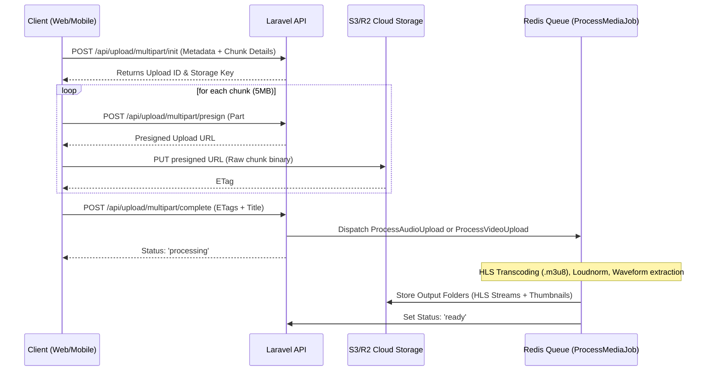

# Project Transfer Document: Te Rurubene Music Ecosystem

This document serves as the master technical blueprint and transition guide for the **Te Rurubene** (Rurubene2) project. It contains the complete system architecture, codebase breakdown, database schemas, deployment procedures, and implementation logs to enable any subsequent developer or AI agent to continue development seamlessly.

---

## 1. Project Overview

*   **Project Name:** Te Rurubene
*   **Purpose:** A Pacific-focused, offline-first digital music and media ecosystem. It provides local artists and studios in remote Pacific regions (such as Kiribati and Fiji) a platform to upload, monetize, stream, and distribute audio tracks, albums, videos, and podcasts.
*   **Target Users:**
    *   **Listeners/Clients:** Consumers who purchase, stream, and download content offline.
    *   **Artists:** Creators uploading tracks/albums and tracking their analytics/earnings.
    *   **Studios:** Production hubs managing multiple artists and setting up customized revenue splits.
    *   **Admins:** Platform regulators approving bank deposits, managing settings, and auditing wallet ledgers.
*   **Business Model:**
    *   Direct transaction fees on track/video/podcast purchases.
    *   Subscription access.
    *   Platform commission cut (configurable, default 10%) automatically split between artists and studio managers.
*   **Development Status:** Advanced development (Phase 5: Pacific Expansion & Offline PWA Sync).

---

## 2. Technology Stack

### Backend
*   **Framework:** Laravel 10.10 (PHP ^8.1)
*   **Auth:** Laravel Sanctum (Token-based Bearer authentication)
*   **Background Jobs:** Laravel Queue (Horizon-enabled, Redis-backed)
*   **Media Processing:** FFmpeg via `pbmedia/laravel-ffmpeg` (Loudness normalization, multi-bitrate HLS transcoding)
*   **Integrations:** Stripe SDK (`stripe/stripe-php`)

### Frontend (Web PWA)
*   **Framework:** Next.js 14.2.35 (TypeScript)
*   **Styling:** Tailwind CSS (Vanilla PostCSS config)
*   **State Management:** Zustand (v5.0)
*   **HLS Playback:** Native browser capability with `hls.js` fallback
*   **PWA Shell:** Custom Service Worker (`sw.js`) with cache persistence and IndexedDB Web Crypto client encryption

### Mobile (Flutter)
*   **SDK:** Flutter (Dart ^3.10.8)
*   **State Management:** Provider & RxDart ChangeNotifiers
*   **Networking:** Dio Client
*   **Audio Engine:** `just_audio` & `audio_service` (for native background audio controls)
*   **Video Engine:** `better_player` (supporting HLS streams, tracks, and subtitles)
*   **Local Storage:** `sqflite` (SQLite wrapper) & `flutter_secure_storage`

### Infrastructure & Services
*   **Database:** PostgreSQL 18 (Dockerized) / MySQL (Production)
*   **Caching & Queue:** Redis (Alpine container)
*   **Search Engine:** Meilisearch (Full-text catalog searches)
*   **Storage:** Cloudflare R2 (S3-compatible) with local fallback storage (MinIO locally)
*   **Web Server:** Nginx (Reverse proxy mapping `/api/` to Laravel and root `/` to Next.js)
*   **Production Host:** Hetzner VPS `91.99.89.94` — managed via PM2 (`rurubene-frontend`)

---

## 3. System Architecture & Core Flows

### 3.1 Media Upload & Processing Pipeline

### 3.2 Double-Entry Wallet Ledger & Transactions
To protect against double-spending and ensure auditability, the system uses a strict double-entry Ledger pattern wrapped in DB transactions with pessimistic locking (`lockForUpdate`).

*   **Signatures:** Every transaction generated via `WalletService` is sealed using a cryptographic signature:
    $$\text{Signature} = \text{HMAC-SHA256}(\text{walletId} : \text{amount} : \text{previousBalance} : \text{type} : \text{timestamp}, \text{APP\_KEY})$$
*   **Stripe Integration:** Checks a `wallet_testing_mode` toggle from Cache. If true, it redirects the checkout flow to a simulated signature-verified callback that triggers the webhook logic immediately. If false, it uses live Stripe Checkout intents.
*   **Offline Deposits:** Users can upload screenshots of local bank deposit receipts (`BankDeposit` model). Admins approve these manually in the Admin dashboard, which programmatically triggers a wallet credit.

### 3.3 P2P Wallet Transfers
Users can transfer wallet balance directly to another user by their **Wallet ID** (not email, for privacy/security).

*   **Flow:** Sender enters recipient's wallet ID + amount + wallet PIN → `WalletController@initiateTransfer` creates a `Transfer` record in `pending` status → recipient accepts/rejects via their wallet dashboard → on acceptance, `WalletService` atomically debits sender and credits receiver with HMAC-signed ledger entries.
*   **Security:** Transfers require wallet PIN verification. Wallet ID is used instead of email to avoid leaking account identity.
*   **Real-time balance:** The wallet page polls on a short interval so the balance refreshes automatically after any transaction without requiring a page reload.
*   **Key files:** `backend/app/Http/Controllers/WalletController.php`, `backend/app/Services/WalletService.php`, `backend/app/Models/Transfer.php`, `frontend/src/app/wallet/page.tsx`.

### 3.4 Revenue Split & Platform Fee System
Every purchase triggers an atomic revenue distribution handled by `RevenueSplitService::distribute()`.

**Default split (platform fee 10%):**
| Recipient | Independent Artist | Studio Artist | Studio (direct) |
|---|---|---|---|
| Platform | 10% | 10% | 10% |
| Artist | 90% | ~78% | — |
| Studio | — | ~22% | 90% |

*   **Configurable fee:** The platform fee % is stored in Laravel Cache (`platform_fee_pct`, default `10`). Admins can change it (5%–30%) via the Admin Settings tab. The new rate applies to **all new purchases immediately**; existing earnings are unaffected.
*   **Notifications on fee change:** When the admin updates the fee, an in-app notification is sent to every `artist` and `studio` role user: *"The platform service fee has been updated from X% to Y%. This applies to all new purchases going forward."*
*   **Confidentiality:** Listeners/buyers never see the fee breakdown — they only see "Total Paid". Artists and Studios see their full earnings breakdown in their wallet dashboard.
*   **Escrow:** Creator earnings (artist/studio) are held in a 24-hour escrow (`release_at`) before becoming `available`. Platform earnings are `available` immediately.
*   **Key files:** `backend/app/Services/RevenueSplitService.php`, `backend/app/Http/Controllers/CommerceController.php`.

### 3.5 Offline PWA Cache & Storage Architecture (Web)
*   **Routing Catch:** The Next.js Service Worker (`sw.js`) intercepts requests. API calls use a Network-First strategy (caching responses as fallback). Static assets use a Stale-While-Revalidate strategy.
*   **CORS & Proxying:** Media files stored on external cloud domains fail CORS in offline playback. To prevent this, the client routes stream downloads through `/media-proxy?url=...` which is resolved directly by Next.js.
*   **Encryption:** Offline downloads are encrypted in IndexedDB (`RurubeneOfflineDB`):
    1.  *Primary:* Web Crypto API `AES-GCM` (Key saved non-extractable).
    2.  *Fallback:* A custom RC4 stream cipher scrambler if Web Crypto is unavailable.
    3.  *Playback:* The data is decrypted inside a local memory buffer and served as a localized Blob URL (`blob:http/...`).

---

## 4. Database Structure

### Core Models & Fields

#### 1. Users (`users`)
*   `id` (BIGINT, PK)
*   `name` (VARCHAR)
*   `email` (VARCHAR, Unique)
*   `password` (VARCHAR)
*   `role` (ENUM: `'admin'`, `'studio'`, `'artist'`, `'client'`)
*   `wallet_pin` (VARCHAR, Hashed)
*   `security_question` (VARCHAR)
*   `security_answer` (VARCHAR, Hashed lowercase)
*   `email_verified_at` (TIMESTAMP)

#### 2. Profiles (`profiles`)
*   `id` (BIGINT, PK)
*   `user_id` (FK to `users`)
*   `country` (VARCHAR)
*   `island` (VARCHAR)
*   `bio` (TEXT)
*   `avatar` (VARCHAR)
*   `cover_image` (VARCHAR)

#### 3. Wallets (`wallets`)
*   `id` (BIGINT, PK)
*   `user_id` (FK to `users`)
*   `balance` (DECIMAL 12, 2)
*   `currency` (VARCHAR, e.g., `'AUD'`)

#### 4. Transactions (`transactions`)
*   `id` (BIGINT, PK)
*   `wallet_id` (FK to `wallets`)
*   `amount` (DECIMAL 12, 2, signed)
*   `type` (ENUM: `'credit'`, `'debit'`)
*   `source` (VARCHAR, e.g., `'stripe'`, `'deposit'`, `'purchase'`, `'redeem'`, `'transfer'`)
*   `description` (VARCHAR)
*   `reference_id` (VARCHAR)
*   `signature` (VARCHAR, SHA-256 HMAC hash)
*   `status` (ENUM: `'pending'`, `'completed'`, `'failed'`)

#### 5. Transfers (`transfers`)
*   `id` (BIGINT, PK)
*   `sender_wallet_id` (FK to `wallets`)
*   `receiver_wallet_id` (FK to `wallets`)
*   `amount` (DECIMAL 10, 2)
*   `status` (ENUM: `'pending'`, `'accepted'`, `'rejected'`, `'cancelled'`)
*   `note` (VARCHAR, Nullable)
*   `created_at`, `updated_at` (TIMESTAMPS)

#### 6. Redeem Codes (`redeem_codes`)
*   `id` (BIGINT, PK)
*   `code` (VARCHAR, Unique, format: `RURU-XXXX-XXXX`)
*   `amount` (DECIMAL 12,2)
*   `status` (ENUM: `'active'`, `'used'`, `'expired'`)
*   `created_by` (FK to `users`)
*   `used_by` (FK to `users`)
*   `expires_at` (TIMESTAMP)

#### 7. Tracks (`tracks`)
*   `id` (BIGINT, PK)
*   `artist_id` (FK to `artists`)
*   `album_id` (FK to `albums`, Nullable)
*   `title` (VARCHAR)
*   `stream_url` (VARCHAR)
*   `duration` (INTEGER)
*   `is_premium` (BOOLEAN)
*   `price` (DECIMAL 8, 2)
*   `status` (ENUM: `'uploading'`, `'processing'`, `'ready'`, `'failed'`)

#### 8. Purchases (`purchases`)
*   `id` (BIGINT, PK)
*   `user_id` (FK to `users`) — the buyer
*   `total_amount` (DECIMAL 10, 2)
*   `status` (ENUM: `'completed'`, `'refunded'`)
*   `transaction_signature` (VARCHAR, Nullable)
*   `created_at`, `updated_at` (TIMESTAMPS)

#### 9. Purchased Contents (`purchased_contents`)
*   `id` (BIGINT, PK)
*   `user_id` (FK to `users`)
*   `purchase_id` (FK to `purchases`)
*   `content_type` (VARCHAR: `'song'`, `'track'`, `'album'`, `'podcast'`, `'ticket'`, `'merchandise'`, `'subscription'`, `'tip'`)
*   `content_id` (BIGINT — polymorphic reference)
*   `price` (DECIMAL 10, 2)
*   `created_at`, `updated_at` (TIMESTAMPS)

#### 10. Creator Earnings (`creator_earnings`)
*   `id` (BIGINT, PK)
*   `purchase_id` (FK to `purchases`)
*   `recipient_type` (VARCHAR: `'artist'`, `'studio'`, `'platform'`)
*   `recipient_id` (BIGINT, Nullable — null for platform rows)
*   `amount` (DECIMAL 10, 2)
*   `status` (ENUM: `'pending'`, `'available'`, `'withdrawn'`, `'refunded'`)
*   `release_at` (TIMESTAMP, Nullable — 24-hour escrow hold for creator rows)
*   `created_at`, `updated_at` (TIMESTAMPS)

#### 11. Notifications (`notifications`)
*   `id` (BIGINT, PK)
*   `user_id` (FK to `users`)
*   `type` (VARCHAR, e.g., `'platform_fee_change'`, `'transfer_received'`, `'deposit_approved'`)
*   `title` (VARCHAR)
*   `message` (TEXT)
*   `data` (JSON, Nullable)
*   `read_at` (TIMESTAMP, Nullable)
*   `created_at`, `updated_at` (TIMESTAMPS)

#### 12. Revenue Splits (legacy: `revenue_splits`)
*   `id` (BIGINT, PK)
*   `artist_id` (FK to `artists`)
*   `studio_id` (FK to `studios`, Nullable)
*   `artist_percentage` (DECIMAL 5,2)
*   `studio_percentage` (DECIMAL 5,2)

> ⚠ This table predates `creator_earnings`. The live fee logic is now handled dynamically by `RevenueSplitService` and stored in `creator_earnings`. `revenue_splits` may be deprecated in a future migration.

---

## 5. API Documentation Quick-Reference

All endpoints are authenticated using a standard Sanctum Bearer token passed in the `Authorization` header.

| Endpoint | Method | Payload | Auth | Description |
| :--- | :--- | :--- | :--- | :--- |
| `/api/register` | POST | `name, email, password, role, wallet_pin, security_question, security_answer` | Public | General registration |
| `/api/login` | POST | `email, password` | Public | Obtains Sanctum Bearer Token |
| `/api/upload/multipart/init` | POST | `file_name, media_type, file_type, is_premium, price` | Required | Prepares direct-to-cloud upload |
| `/api/upload/multipart/presign`| POST | `upload_id, key, part_number` | Required | Obtains a signed S3 URL for a single chunk |
| `/api/upload/multipart/complete`|POST| `upload_id, key, parts (array), title` | Required | Finishes upload & dispatches FFmpeg task |
| `/api/wallet` | GET | None | Required | Retrieves wallet balance & recent transactions |
| `/api/wallet/topup/intent` | POST | `amount, source` | Required | Initiates Stripe flow (simulated or live) |
| `/api/wallet/redeem` | POST | `code` | Required | Redeems wallet balance voucher code |
| `/api/wallet/transfers` | GET | None | Required | Lists sent & received transfers |
| `/api/wallet/transfers/initiate` | POST | `receiver_wallet_id, amount, pin, note` | Required | Initiates a P2P wallet transfer |
| `/api/wallet/transfers/{id}/accept` | POST | `pin` | Required | Accepts an incoming transfer |
| `/api/wallet/transfers/{id}/reject` | POST | None | Required | Rejects an incoming transfer |
| `/api/wallet/transfers/{id}/cancel` | POST | None | Required | Cancels a pending outgoing transfer |
| `/api/checkout` | POST | `items (array of {id, type})` | Required | Processes cart purchases securely |
| `/api/admin/ledger` | GET | None | Admin | System-wide financial ledger summary |
| `/api/admin/ledger/transactions` | GET | `type, source, user_search, sort_by, sort_dir, page` | Admin | Paginated transaction log |
| `/api/admin/revenue-transactions` | GET | `search, page` | Admin | Paginated platform 10% fee transactions with creator/buyer details |
| `/api/admin/settings` | GET | None | Admin | Get current platform settings |
| `/api/admin/settings` | POST | `wallet_testing_mode?, platform_fee_pct?` | Admin | Update platform settings & notify creators if fee changes |

---

## 6. Admin Dashboard — Ledger & Revenue Features

### 6.1 System Ledger (`GET /api/admin/ledger`)
Returns a comprehensive snapshot of platform financial health:
- `system_total_balance` — sum of all user wallet balances
- `total_credits_in` / `total_debits_out` / `withdrawals_out`
- `net_position` — credits minus debits
- `balance_by_role` — wallet totals grouped by user role
- `users_by_role` — per-user balance drill-down
- `revenue_by_source` — credit transactions grouped by source type
- `platform_revenue` — **all-time total 10% fee income** from `creator_earnings` (platform rows)
- `platform_revenue_by_month` — last 6 months of fee income, count + total

### 6.2 Revenue Transactions (`GET /api/admin/revenue-transactions`)
Paginated table (25/page) joining `creator_earnings → purchases → purchased_contents → tracks/albums → artists → users`:
- Buyer name & email
- Content title & type
- Creator/artist name & email
- Full sale amount
- Platform cut (10% fee)
- Status & date
- Searchable by buyer name/email, creator name, content title

### 6.3 Platform Fee Control (Admin Settings Tab)
*   Live slider control (5%–30%)
*   Real-time split preview (Artist / Studio / Platform %)
*   On save: persists to Laravel Cache (`platform_fee_pct`) — immediately applies to all new purchases
*   Auto-broadcasts in-app notification (`platform_fee_change` type) to all `artist` and `studio` users

---

## 7. Crucial Business Logic & Rules

*   **Never Rebuild Multipart Uploads:** The multi-part direct-to-R2 upload system in `MultipartUploadController` handles large media chunks without buffering through PHP memory. It is highly optimized and should not be modified.
*   **Database Locking:** Any debit/credit action on a wallet MUST use `lockForUpdate()` within a `DB::transaction`. Do not call raw arithmetic queries that skip validation.
*   **Simulated Webhooks:** The `wallet_testing_mode` config bypasses external APIs. Ensure automated deployment scripts sync this environment variable safely to avoid breaking tests.
*   **Fee Confidentiality:** Listeners must never see the platform fee or creator split breakdown. `CartOverlay.tsx` shows only "Total Paid". Fee details are exclusive to artists, studios, and admins.
*   **Fee Clamping:** `RevenueSplitService` clamps `platform_fee_pct` to the range 5–30 even if the Cache value is corrupted. Never set this outside this range.
*   **Escrow Hold:** Creator earnings (`artist`, `studio` rows in `creator_earnings`) are held for 24 hours (`release_at`). Platform earnings are available immediately. Do not bypass the escrow when crediting creator wallets.
*   **Transfer Security:** P2P transfers require wallet PIN verification. Transfers are identified by **Wallet ID** (not email) to prevent account enumeration.

---

## 8. Deployment

### Production Server
- **Host:** Hetzner VPS `91.99.89.94`
- **User:** `root`
- **Backend path:** `/var/www/rurubene2/backend`
- **Frontend path:** `/var/www/rurubene2/frontend`
- **Process manager:** PM2 (`rurubene-frontend` process, ID 0)

### Deploy Scripts (in project root)
| Script | Purpose |
|---|---|
| `deploy_transfer.py` | Primary deploy — SCPs individual modified files, clears Laravel caches, runs `npm run build`, restarts PM2 |
| `rebuild_frontend.py` | Clean frontend rebuild only — deletes `.next/`, runs `npm run build`, restarts PM2. Use after build failures. |
| `remote_tinker.py` | SSH into production for ad-hoc Artisan/DB commands |
| `read_remote_logs.py` | Tails PM2 or Laravel logs from production |
| `run_db_check.py` | Checks production database table state |

### Deploy Workflow
1. Make changes locally
2. Add new files to `FILES` list in `deploy_transfer.py` if needed
3. Run: `python3 deploy_transfer.py`
4. If build fails with `middleware-manifest.json` error, run: `python3 rebuild_frontend.py`

---

## 9. Key Files Reference

| File | Role |
|---|---|
| `backend/app/Services/RevenueSplitService.php` | Core fee split logic — reads `platform_fee_pct` from Cache |
| `backend/app/Services/WalletService.php` | Atomic wallet credit/debit with HMAC signing |
| `backend/app/Http/Controllers/CommerceController.php` | Checkout handler — calls RevenueSplitService |
| `backend/app/Http/Controllers/AdminController.php` | Admin ledger, revenue transactions, settings (fee control + notifications) |
| `backend/app/Http/Controllers/WalletController.php` | Wallet balance, transfers, withdrawal initiation |
| `backend/app/Models/CreatorEarning.php` | Revenue split rows per purchase |
| `backend/app/Models/Transfer.php` | P2P wallet transfer records |
| `backend/app/Models/Notification.php` | In-app notification model |
| `frontend/src/app/admin/page.tsx` | Admin dashboard (ledger, revenue table, fee slider, settings) |
| `frontend/src/app/wallet/page.tsx` | User wallet (balance, transfers, send/receive UI) |
| `frontend/src/components/CartOverlay.tsx` | Checkout UI — hides fee breakdown from listeners |
| `backend/routes/api.php` | All API route definitions |

---

## 10. Known Issues & Tech Debt

1.  **Duplicate SQLite Helpers in Flutter:**
    *   `mobile/lib/core/db/database_helper.dart` creates a `profiles` table.
    *   `mobile/lib/core/services/database_helper.dart` creates `tracks`, `products`, and `wallet` tables.
    *   *Risk:* Both helpers target the same SQLite file `rurubene.db`. If they initialize at different times, the first initialization will create only some tables. The second helper will see the DB file exists and skip creation, resulting in missing tables and runtime crashes.
    *   *Solution:* These database helpers need to be unified into a single database initialization helper.

2.  **Placeholder Video Purchase Validation:**
    *   The purchase check inside the `User` model currently uses placeholders for video entities. A robust `purchased_videos` relational table needs to be set up.

3.  **FFmpeg Worker Resources:**
    *   FFmpeg conversion is resource-intensive. If hosted on a low-end VPS, multiple simultaneous uploads can CPU-starve the Laravel process. Background jobs should be delegated to a separate scaling queue worker.

4.  **Revenue Split — RevenueSplitService Sync:**
    *   The `revenue_splits` table is a legacy structure. The live fee logic is now fully dynamic in `RevenueSplitService`. The old table should be migrated or removed to avoid confusion.

5.  **Platform Fee Cache Persistence:**
    *   `platform_fee_pct` is stored in Laravel's application cache (Redis-backed). If the Redis cache is cleared completely (e.g., `php artisan cache:clear`), the fee will revert to the default 10%. Consider migrating this setting to a dedicated `platform_settings` database table for true persistence.
